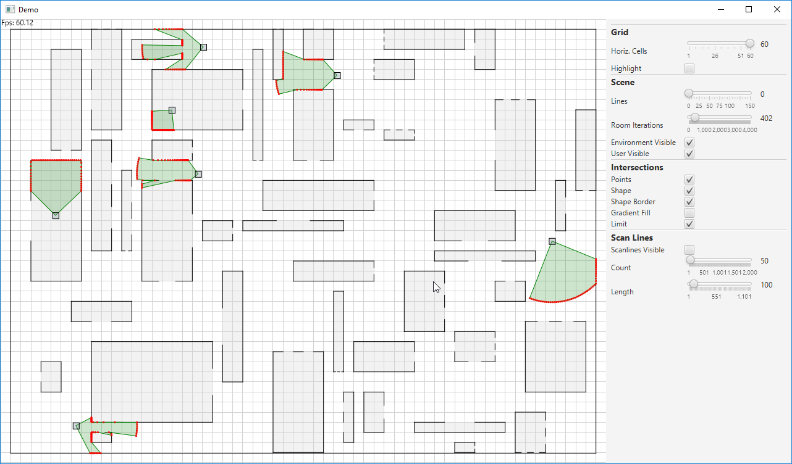

Simple line of sight test using scan lines per agent to detect intersections with walls or other agents. The agents move simply along the average of all intersection points of their own scan cone.

